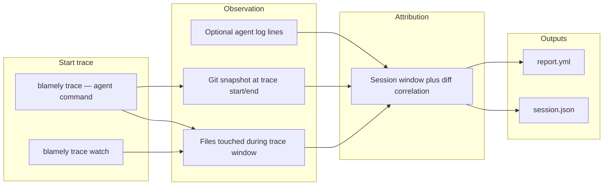

# Blamely.ai — Trace AI CLI changes: architecture, report format, and plan

This document describes how **blamely.ai** **traces changes caused by AI when it is invoked from the terminal** (shell-based agents, coding CLIs, headless agent runs). The goal is to **attribute those edits** against normal human work and emit **`report.yml`** in the **Blamely report schema** so the same dashboards, hooks, and compliance flows can consume editor-based and **AI-CLI** traces alike.

---

## 1. Business description (blamely.ai)

**Blamely** (**blamely.ai**) answers: *which files and lines changed because an **AI agent ran from the command line**, versus a person editing outside that run?* Typical invocations include terminal “coding agents,” patch tools, and scripted LM calls that **write to the working tree** without going through the IDE.

Teams use this for:

- **Code review:** Reviewers see what landed during a **traced AI-CLI session** versus unrelated edits.
- **Governance:** Export **YAML** with per-file AI/human splits and optional model metadata instead of raw terminal transcripts.
- **Audit:** Tie **`git diff`** to **session start/end** so history matches **what the shell agent did**.

**Value proposition:** **Local-first tracing** on the developer machine: snapshot git, bracket the child process (or correlate via watch + logs), classify touched files, write **`.blamely/trace/`** (or align with **`.git/blamely/`**) without sending code to Blamely by default.

**Primary users:** Developers who run **AI from the shell**; leads and compliance owners who ingest **`report.yml`** in CI or archives.

---

## 2. Architecture: tracing AI CLI changes

High-level flow:



| Piece | Responsibility |
|--------|----------------|
| **`blamely trace`** | Wraps the **AI CLI / agent command**: record trace id, start/end, exit code, cwd; capture **`HEAD`** and branch; after the process exits, **`git diff`** vs start → classify which changes count as **AI-CLI** vs human. |
| **`blamely trace watch`** | When the agent is **not** launched under trace: debounced filesystem + git correlation to the same session semantics (optional). |
| **Trace store** | **`session.json`** per run: times, sanitized argv, per-file classification, **confidence**, **reasons**. |
| **Classifier** | Labels file changes **AI / human / mixed / unknown** from the trace window, overlap rules, optional log timestamps. |
| **Report writer** | **`report.yml`** per Blamely schema (Section 3). |
| **Config** | **`blamely.yaml`**: ignore globs, debounce, optional log paths, redaction. |

**Accuracy:** Tracing **AI CLI changes** is **inference-based**: you see **process lifetime** and **repo diffs**, not keystrokes. Session JSON must carry **`confidence`** (`high` | `medium` | `low`) and **`reasons`**; **`report.yml`** holds rollups for reporting.

---

## 3. Report format (`report.yml`) — Blamely schema

Traces MUST emit **`report.yml`** compatible with the **Blamely report layout**.

### 3.1 Top-level fields

| Field | Purpose |
|-------|---------|
| `scope` | Use **`ai_cli_trace`** (or **`cli_session`**) for terminal agent runs; **`this_commit`** if aligned to a single commit. |
| `commitDate` | ISO-8601 report generation time. |
| `detector_version` | Tracer version string. |
| `branch`, `commit_hash`, `commit_message` | Git context (`commit_message` may be **`N/A`** for working-tree-only traces). |
| `summary` | File and line totals; **AI vs human** buckets; **`ai_percentage`**, **`model_count`**. |
| `metrics` | Optional **`first_start_coding_time`**, **`time_waiting_for_ai_ms`**. |
| `agent_info` | e.g. **`ide: "ai_cli"`** or agent name; **`models[]`**; **`interaction_types[]`** e.g. `terminal_agent`, `git_diff_correlation`. |
| `files[]` | Per-file lines and metadata. |

### 3.2 Example `report.yml` (after tracing an AI CLI run)

Representative output after **`blamely trace -- cursor-agent "refactor auth"`** (example command only):

```yaml
scope: "ai_cli_trace"
commitDate: "2026-05-13T14:22:01.123Z"
detector_version: "1.0.0"
branch: "feature/auth-hardening"
commit_hash: "a1b2c3d4e5f6789012345678901234567890abcd"
commit_message: "N/A"

summary:
  total_files_changed: 2
  total_lines_added: 48
  total_lines_deleted: 12
  total_changes: 60
  ai_lines_added: 40
  ai_lines_deleted: 10
  human_lines_added: 8
  human_lines_deleted: 2
  ai_percentage: "83.3%"
  model_count: 1

metrics:
  first_start_coding_time: "2026-05-13T14:18:00.000Z"
  time_waiting_for_ai_ms: 120000

agent_info:
  ide: "ai_cli"
  models:
    - "gpt-5.1"
  interaction_types:
    - terminal_agent
    - git_diff_correlation

files:
  - path: "internal/auth/handler.go"
    source: "ai_cli_trace"
    model: "gpt-5.1"
    ai_lines_added: 28
    ai_lines_deleted: 6
    human_lines_added: 4
    human_lines_deleted: 1
    lines_deleted: 7
    total_changes: 39
    ai_percentage: "87.2%"
    prompts: []
  - path: "internal/auth/handler_test.go"
    source: "ai_cli_trace"
    model: "gpt-5.1"
    ai_lines_added: 12
    ai_lines_deleted: 4
    human_lines_added: 4
    human_lines_deleted: 1
    lines_deleted: 5
    total_changes: 21
    ai_percentage: "76.2%"
    prompts: []
```

Use **`files[].prompts`** only when policy allows; **`--redact`** may store hashes in **`session.json`** instead.

### 3.3 Example trace record (`session.json`)

```json
{
  "schema_version": 1,
  "trace_id": "7c9e2b1a-4d5e-4f60-9c0b-example",
  "scope": "ai_cli_trace",
  "started_at": "2026-05-13T14:18:00.000Z",
  "ended_at": "2026-05-13T14:22:00.000Z",
  "repo_root": "/Users/dev/projects/acme",
  "git": {
    "branch": "feature/auth-hardening",
    "head_at_start": "a1b2c3d4e5f6789012345678901234567890abcd"
  },
  "traced_command": {
    "argv": ["cursor-agent", "refactor auth"],
    "exit_code": 0
  },
  "files": [
    {
      "path": "internal/auth/handler.go",
      "classification": "ai",
      "confidence": "high",
      "reasons": ["change_within_trace_window"]
    },
    {
      "path": "README.md",
      "classification": "mixed",
      "confidence": "low",
      "reasons": ["interleaved_activity", "edit_after_trace_end"]
    }
  ]
}
```

Trace metadata rolls up into **`report.yml`** **`summary`** and **`files[]`**; document how **mixed** / **unknown** map to line splits in the tracer README.

**User-facing usage:** Command examples, flags, and **`blamely.yaml`** samples belong in the **tracer CLI README** (or **`--help`**), not in this document.

---

## 4. Implementation plan (trace AI CLI changes)

### Phase 1 — MVP

- **`blamely trace`** with git snapshot, diff, **`session.json`**, **`report.yml`** (Section 3).
- Optional debounced FS events during the traced child process.
- Unit tests: synthetic timelines → expected **AI-CLI** vs human classification.

### Phase 2 — Robustness

- **`blamely trace watch`**, overlap heuristics, **`--strict-trace-window`** (optional policy flag).
- Log parsers for common terminal agents; document **confidence** in user docs.

### Phase 3 — Ecosystem

- CI gates on **`summary.ai_percentage`** or per-file **`ai_percentage`**.
- Merge **AI-CLI traces** with editor attribution in consumers that share the **`report.yml`** field names.

---

## 5. Success criteria

- **Product:** Teams can see **what changed due to AI invoked from the shell** vs other edits.
- **Engineering:** **`report.yml`** stays compatible with the Blamely layout (**`scope`**, **`summary`**, **`agent_info`**, **`files[]`**) for **blamely.ai** and downstream tooling.

---

## 6. Document maintenance

Prefer **`scope: ai_cli_trace`** for terminal-only traces. If new fields are needed, add an optional **`ai_cli:`** section rather than renaming core **`summary`** / **`files[]`**. Refresh Section 3 examples when the canonical schema changes.
